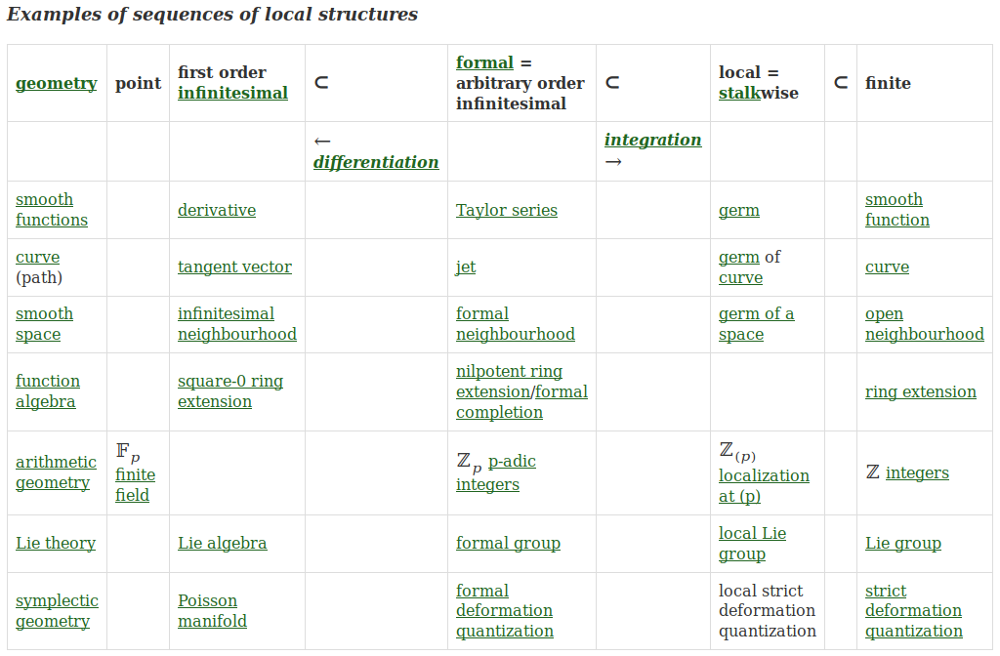

<https://ncatlab.org/nlab/show/filtered+limit>

<https://mathoverflow.net/questions/196055/what-is-the-explicit-ideal-wrt-the-lazard-ring-generated-by-the-associativity>

Hiro Lee Tanaka's Fall 2014 Math 230a

> As part of the definition of graded algebra, m must be associative.
> A graded algebra is unital if it admits a unit 1 ∈ A 0 . 8
> An example is the deRham cohomology algebra of any smooth
> manifold.
> Another example is the deRham algebra of smooth differential
> forms on a manifold. (I.e., what we have before taking cohomol-
> ogy.) This has more structure than just that of a graded algebra;
> we’ll come back to it in another homework.
> Another example is the polynomial ring in one generator,
> R[x], where A k is the vector space of homogeneous degree k poly-
> nomials. A variant is R[y], where A 2k is the vector space of ho-
> mogeneous degree k polynomials, and A odd is zero. (So y is in
> “degree” 2.) **Depending on your taste, R[y] is isomorphic to the
> deRham cohomology ring of CP ∞ . If your taste is different, then
> the power series ring R[[y]] is rather isomorphic to the deRham
> cohomology ring of CP ∞ .**
> A map between graded algebras is a linear map f : A k → B k
> for every k such that f (m A (a, a � )) = m B (f a, f a � ). A map between
> unital graded algebras further sends the unit to the unit.
> We let GrAlg R be the category of unital graded algebras over
> R, where morphisms are maps of graded unital algebras.

nLab concept map

Richard Green office hours

> consider the inverse limit to define an -adic ring 

<https://ncatlab.org/nlab/show/formal+group>

> Definition 1.1. An (commutative) adic ring is a (commutative) topological ring AA and an ideal I⊂AI \subset A such that
> 
>     the topology on AA is the II-adic topology;
> 
>     the canonical morphism
>     A⟶lim⟵ n(A/I n) A \longrightarrow \underset{\longleftarrow}{\lim}_n (A/I^n)
> 
>     to the limit over quotient rings by powers of the ideal is an isomorphism.

ON THE FORMAL GROUP LAWS OF UNORIENTED AND COMPLEX COBORDISM THEORY by daniel quillen

> In this note we outline a connection between the generalized co-
> homology theories of unoriented cobordism and (weakly-) complex
> cobordism and the theory of formal commutative groups of one vari-
> able [4], [5]. This connection allows us to apply Cartier's theory of
> typical group laws to obtain an explicit decomposition of complex
> cobordism theory localized at a prime p into a sum of Brown-Peterson
> cohomology theories [ l ] and to determine the algebra of cohomology
> operations in the latter theory.

<https://en.wikipedia.org/wiki/Michel_Lazard>

> Michel Paul Lazard (5 December 1924 – 15 September 1987) was a French mathematician who worked in the theory of Lie groups in the context of p-adic analysis. His work took on a life of its own in the hands of Daniel Quillen in the late 20th century. Quillen's discovery, that a ring Lazard used to classify formal group laws was isomorphic to an important ring in topology, lead to the subject of chromatic homotopy theory.

> Lazard's self-contained treatise on one-dimensional formal groups also birthed the field of p-divisible groups.

> His major contributions:

>     The classification of p-adic Lie groups: every p-adic Lie group is a closed subgroup of G L n ( Z p ) {\displaystyle {\rm {GL}}_{n}(\mathbb {Z} _{p})} {\displaystyle {\rm {GL}}_{n}(\mathbb {Z} _{p})}.
>     The classification of (1-dimensional commutative) formal groups.
>     The universal formal group law coefficient ring (Lazard's universal ring) is a polynomial ring.
>     The concept of "analyseurs", reinvented by J. Peter May under the name operads.

Complex cobordism and formal group laws, Mike Hill

> We'll discuss complex orientations and explain how a complex-oriented theory carries a formal group law over its coefficient ring. We then describe the universal example, complex cobordism, and discuss Quillen's theorem and its applications to co-operations for complex-oriented cohomology theories.

<https://en.wikipedia.org/wiki/Highly_structured_ring_spectrum>

> Highly structured ring spectra have better formal properties than multiplicative cohomology theories – a point utilized, for example, in the construction of topological modular forms, and which has allowed also new constructions of more classical objects such as Morava K-theory. Beside their formal properties, E ∞ {\displaystyle E_{\infty }} E_\infty-structures are also important in calculations, since they allow for operations in the underlying cohomology theory, analogous to (and generalizing) the well-known Steenrod operations in ordinary cohomology. As not every cohomology theory allows such operations, not every multiplicative structure may be refined to an E ∞ {\displaystyle E_{\infty }} E_\infty-structure and even in cases where this is possible, it may be a formidable task to prove that.
> 
> The rough idea of highly structured ring spectra is the following: If multiplication in a cohomology theory (analogous to the multiplication in singular cohomology, inducing the cup product) fulfills associativity (and commutativity) only up to homotopy, this is too lax for many constructions (e.g. for limits and colimits in the sense of category theory). On the other hand, requiring strict associativity (or commutativity) in a naive way is too restrictive for many of the wanted examples. A basic idea is that the relations need only hold up to homotopy, but these homotopies should fulfill again some homotopy relations, whose homotopies again fulfill some further homotopy conditions; and so on. The classical approach organizes this structure via operads, while the recent approach of Jacob Lurie deals with it using ∞ {\displaystyle \infty } \infty -operads in ∞ {\displaystyle \infty } \infty -categories. The most widely used approaches today employ the language of model categories.[citation needed]
> 
> All these approaches depend on building carefully an underlying category of spectra.
> 
> It is easiest to write down concrete examples of E ∞ {\displaystyle E_{\infty }} E_\infty-ring spectra in symmetric/orthogonal spectra. The most fundamental example is the sphere spectrum with the (canonical) multiplication map S n ∧ S m → S n + m {\displaystyle S^{n}\wedge S^{m}\to S^{n+m}} S^{n}\wedge S^{m}\to S^{{n+m}}. It is also not hard to write down multiplication maps for Eilenberg-MacLane spectra (representing ordinary cohomology) and certain Thom spectra (representing bordism theories). Topological (real or complex) K-theory is also an example, but harder to obtain: in symmetric spectra one uses a C-star-algebra interpretation of K-theory, in the operad approach one uses a machine of multiplicative infinite loop space theory.

Ravenel's Green Book Complex Cobordism and Stable Homotopy Groups of Spheres

> A similar statement is true of ordinary cohomology and the formal group law
> one gets is the additive one; this is a restatement of the fact that the first Chern
> class of a tensor product of complex line bundles is the sum of the first Chern
> classes of the factors. One can play the same game with complex K-theory and get
> a multiplicative formal group law.
> CP ∞ is a good test space for both complex cobordism and K-theory. One
> can analyze the algebra of operations in both theories by studying their behavior
> in CP ∞ (see Adams [5]) in the same way that Milnor [2] analyzed the mod (2)
> Steenrod algebra by studying its action on H ∗ (RP ∞ ; Z/(2)). (See also Steenrod
> and Epstein [1].)
> The formal group law of 1.3.3 is not as simple as the ones for ordinary co-
> homology or K-theory; it is complicated enough to have the following universal
> property.
> 1.3.4. Theorem (Quillen [2]). For any formal group law F over any commuta-
> tive ring with unit R there is a unique ring homomorphism θ : M U ∗ (pt) → R such
> that F (x, y) = θF U (x, y).
> 
> We remark that the existence
> of such a universal formal group law is a triviality.
> Simply write F (x, y) =
> a i,j x i y i and let L = Z[a i,j ]/I, where I is the ideal
> generated by the relations among the a i,j imposed by the definition 1.3.1 of an
> formal group law. Then there is an obvious formal group law over L having the
> universal property. Determining the explicit structure of L is much harder and was
> first done by Lazard [1]. Quillen’s proof of 1.3.4 consisted of showing that Lazard’s
> universal formal group law is isomorphic to the one given by 1.3.3.
> Once Quillen’s Theorem 1.3.4 is proved, the manifolds used to define complex
> bordism theory become irrelevant, however pleasant they may be. All of the ap-
> plications we will consider follow from purely algebraic properties of formal group
> laws. This leads one to suspect that the spectrum M U can be constructed some-
> how using formal group law theory and without using complex manifolds or vector
> bundles. Perhaps the corresponding infinite loop space is the classifying space for
> some category defined in terms of formal group laws. Infinite loop space theorists,
> where are you?

> Chapter 4. BP -Theory and the Adams–Novikov Spectral Sequence
> 1. Quillen’s Theorem and the Structure of BP ∗ (BP )
> Complex cobordism. Complex orientation of a ring spectrum. The formal
> group law associated with a complex oriented homology theory. Quillen’s theorem
> equating the Lazard and complex cobordism rings.

> Appendix A2. Formal Group Laws
> 1. Universal Formal Group Laws and Strict Isomorphisms
> Definition and examples of formal group laws. Homomorphisms, isomorphisms
> and logarithms. The universal formal group law and the Lazard ring. Lazard’s
> comparison lemma. The Hopf algebroid V T . Proof of the comparison lemma.
> 2. Classification and Endomorphism Rings
> Hazewinkel’s and Araki’s generators. The right unit formula. The height of a
> formal group law. Classification in characteristic p. Finite fields, Witt rings and
> division algebras. The endomorphism ring of a height n formal group law.

## some videos to watch

- 2013-02-27-glasman-a-review-of-stable-homotopy-theory.mp4
- 2013-02-27-nardin-formal-group-laws-and-complex-cobordism.mp4
- 2013-03-06-brantner-p-typical-formal-group-laws-and-brown-peterson-homology.mp4
- 2018-05-16-hill-mu-and-formal-group-laws.mp4
- 2018-05-16-wilson-bp-landweber-exactness-and-other-examples.mp4
